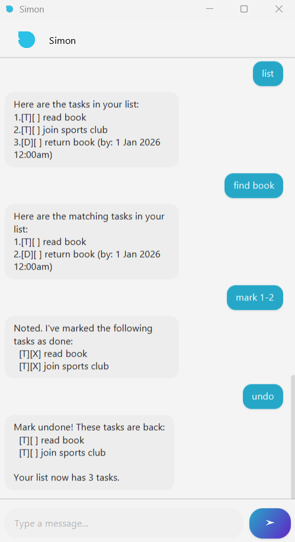

# Simon User Guide



Manage your tasks efficiently and effortlessly with Simon, a user-friendly task management application. Simon helps you add, organize, and track your tasks, deadlines, and events. It supports single and batch operations, undo functionality, and filtering by date.

Features at a glance
* **Add tasks:** Todos, Deadlines, and Events
* **List tasks:** See all tasks in your list
* **Mark/unmark tasks:** Track single or multiple completed and pending tasks
* **Delete tasks:** Remove single or multiple tasks
* **Multi-commands/Command chaining:** Execute multiple commands at once using `&&`
* **Undo actions:** Revert your last action
* **Search tasks:** Find tasks containing keywords
* **View tasks by date:** List tasks occurring on a specific date
* **Command history navigation:** Use ↑ and ↓ keys to navigate previous commands

For quick navigation of this User Guide:
1. [Quick Start](#quick-start)
2. [Commands](#commands)
   - [Adding Tasks](#adding-tasks)
   - [Listing Tasks](#listing-tasks)
   - [Marking Tasks](#marking-tasks)
   - [Deleting Tasks](#deleting-tasks)
   - [Searching Tasks](#searching-tasks)
   - [Viewing Tasks on a Specific Date](#viewing-tasks-on-a-specific-date)
   - [Undo Last Action](#undo-last-action)
   - [Exiting Simon](#exiting-simon)
3. [Pro Tips](#pro-tips)
4. [Command Summary](#command-summary)

## Quick Start
1. **Download and Install**: Get the latest version of Simon from the [releases page](https://github.com/jolenechong/ip/releases)
2. **Run the Application**: `cd` into the folder with the downloaded JAR file and run it via command line:
   ```
   java -jar simon.jar
   ```
3. **Start Managing Tasks**: Use the commands outlined below to add, list, mark tasks

## Commands

### Adding Tasks
Simon allows you to add three types of tasks:
1. **Todo**, a simple task without a deadline.
2. **Deadline**, a task that must be completed by a specific date/time.
3. **Event**, a task that happens over a specific time period.

To add a task, use the following commands:
- `todo <description>`: Adds a Todo task.
- `deadline <description> /by <date/time>`: Adds a Deadline task.
- `event <description> /from <start date/time> /to <end date/time>`: Adds an Event task.

When specifying date/time for `deadline` (`/by`) or `event` (`/from` and `/to`) commands, Simon accepts the following formats.

Date & time (use these when a time is required):

- ISO local date-time `eg. 2025-08-31T18:00`
- Day/Month/Year with 24-hour time `eg. 31/8/2025 1800`
- Day-Month-Year with 24-hour time `eg. 31-8-2025 1800`
- Year/Month/Day with 24-hour time `eg. 2025/08/31 1800`

Date only (use these when you only need a date; time will default to start of day):

- ISO local date `eg. 2025-08-31`
- Day/Month/Year `eg. 31/8/2025`           
- Day-Month-Year `eg. 31-8-2025`
- Year/Month/Day `eg. 2025/08/31`
- Day Month Year (abbreviated month name) `eg. 31 Aug 2025`

  **Example:**

```
todo Read book
```

**Outcome:**

```
Got it. I've added this task:
[T][ ] Read book
Now you have 1 task in the list.
```

**Example:**
```
deadline Submit report /by 31/8/2025 1800
```

**Outcome:**

```
Got it. I've added this task:
  [D][ ] Submit report (by: 31 Aug 2025 6:00pm)
Now you have N tasks in the list.
```

---

### Listing Tasks

```
list
```

Displays all tasks in the list with their type, status, and details.

---

### Marking Tasks

**Mark as done:**

```
mark <index>
```

**Mark as not done:**

```
unmark <index>
```
Marks task at <index> as done/not done accordingly. Index starts from 1 and refers to the index number shown in the displayed list.

**Multi-mark/unmark:**

```
mark 1,3
unmark 2-4
```
Marks tasks 1 and 3, unmarks tasks 2 to 4.

---

### Deleting Tasks

**Delete a single task:**

```
delete <index>
```

**Delete multiple tasks:**

```
delete 1,3
delete 2-4
```
Deletes tasks 1,3 and tasks 2 to 4 respectively.

---

### Searching Tasks

**Find tasks containing a keyword:**

```
find <keyword>
```

**Example:**

```
find book
```

**Outcome:**

```
Here are the matching tasks in your list:
1.[T][ ] read book
2.[D][ ] return book (by: 1 Jan 2026 12:00am)
```

---

### Viewing Tasks on a Specific Date

```
on <date>
```

**Example:**

```
on 1/1/2026
```

**Outcome:**

```
Here are the tasks on 1 Jan 2026:
1.[D][ ] return book (by: 1 Jan 2026 12:00am)
2.[E][ ] book event (from: 1 Jan 2026 10:00am to: 1 Jan 2026 12:00pm)
```

---

### Undo Last Action

```
undo
```

Restores the last executed command (adding, deleting, marking, multi-delete, or multi-mark).

---

### Exiting Simon

```
bye
```

Closes the application.

---

### Pro Tips

* Use `&&` to chain multiple commands:

```
todo Read book && deadline Submit report /by 18/2/2026 2359
```

* Use **up/down arrow keys** to navigate through your previous commands for faster input.

---

Simon makes task management simple and fun. Stay organized and never forget a task again! ✅

## Command Summary

| Action             | Command Format                                                    | Description                                        |
|--------------------|-------------------------------------------------------------------|----------------------------------------------------|
| Add Todo           | `todo <description>`                                              | Adds a Todo task.                                  |
| Add Deadline       | `deadline <description> /by <date/time>`                          | Adds a Deadline task.                              |
| Add Event          | `event <description> /from <start date/time> /to <end date/time>` | Adds an Event task.                                |
| List Tasks         | `list`                                                            | Displays all tasks in the list.                    |
| Mark Task          | `mark <index>`                                                    | Marks the task at the specified index as done.     |
| Unmark Task        | `unmark <index>`                                                  | Marks the task at the specified index as not done. |
| Multi-mark Tasks   | `mark 1,3` or `mark 2-4`                                          | Marks multiple tasks as done.                      |
| Multi-unmark Tasks | `unmark 1,3` or `unmark 2-4`                                      | Marks multiple tasks as not done.                  |
| Delete Task        | `delete <index>`                                                  | Deletes the task at the specified index.           |
| Multi-delete Tasks | `delete 1,3` or `delete 2-4`                                      | Deletes multiple tasks.                            |
| Find Tasks         | `find <keyword>`                                                  | Finds tasks containing the specified keyword.      |
| View Tasks by Date | `on <date>`                                                       | Lists tasks occurring on the specified date.       |
| Undo Last Action   | `undo`                                                            | Reverts the last executed command.                 |
| Exit Simon         | `bye`                                                             | Closes the application.                            |
| Command Chaining   | `<command1> && <command2>`                                        | Executes multiple commands in sequence.            |

